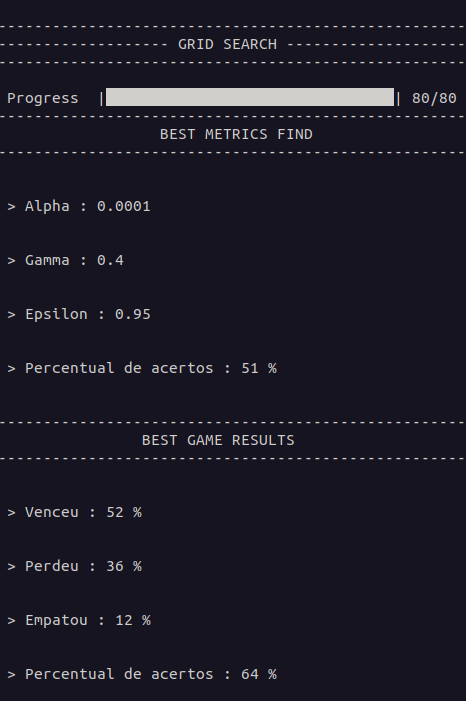

##  blackjack-reply98 🃏️


### Bibliotecas ⚙️

Instale as dependências:

```bash
  pip install -r requirements.txt
```

### Parâmetros para o código 📌️

Nas primeiras linhas do código temos o seguinte:

```bash
    # Condições do programa:
    treino = True
    method = 'qlearning'
```

O parâmetro de treino indica se será feita uma GridSearch para a busca dos melhores parâmetros (**treino = True**) , ou se deseja utilizar a tabela já pronta em `data/q-table-blackjack.csv` (**treino = False**).

o parâmetro método define com qual algorítimo o treino será feito Sarsa (**method = sarsa**) ou QLearning (**method = qlearning**).

### Melhores Hyperparâmetros - 64% de "não derrotas"


| Atributo        |  Valor     |
|:----------------|:----------:|
| Algoritmo       | Qlearning  |
| alpha           |  0.0001    |
| gamma           |    0.4     |
| epsilon         |    0.95    |
| epsilon_dec     |   0.9999   |
| epsilon_min     |  0.0001    |
| qtd_episodios   |   100000   |

O arquivo `data/info_parameters.json` apresenta o desempenho de cada um dos hyperparâmetros utiliazdos para o treino.




### Gráfico Qtable
