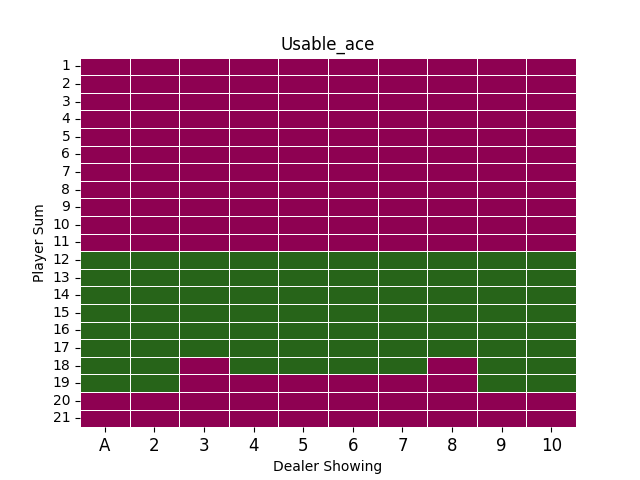

## 🃏️ Blackjack Agent

<div align="center" style="max-width:68rem;">
<table>
  <tr>
    <td align="center"><a href="https://github.com/matheus-1618"><br /><sub><b>Matheus Oliveira</b></sub></a><br /><a href="https://github.com/matheus-1618" title="Matheus Silva M. Oliveira"></a> Developer</td>
   <td align="center"><a href="https://github.com/niveaabreu"><br /><sub><b>Nívea de Abreu</b></sub></a><br /><a href="https://github.com/niveaabreu" title="Nívea de Abreu"></a>Developer</td>
      <td align="center"><a href="https://github.com/leticiacb1"><br /><sub><b>Letícia Côelho</b></sub></a><br /><a href="https://github.com/leticiacb1" title="Letícia Côelho"></a>Developer</td>

  </tr>
</table>
</div>


### ⚙️ Bibliotecas 

Instale as dependências:

```bash
  pip install -r requirements.txt
```

### 📌️ Parâmetros para o código 

Nas primeiras linhas do código temos o seguinte:

```bash
    # Condições do programa:
    treino = True
    method = 'qlearning'
```

O parâmetro de treino indica se será feita uma GridSearch para a busca dos melhores parâmetros (**treino = True**) , ou se deseja utilizar a tabela já pronta em `data/q-table-blackjack.csv` (**treino = False**).

o parâmetro método define com qual algorítimo o treino será feito Sarsa (**method = sarsa**) ou QLearning (**method = qlearning**).

#### Melhores Hyperparâmetros - 64% de "não derrotas" (Soma de vitórias e empates)

<div align="center" style="max-width:68rem;">

| Atributo        |  Valor     |
|:----------------|:----------:|
| Algoritmo       | Qlearning  |
| alpha           |  0.0001    |
| gamma           |    0.4     |
| epsilon         |    0.95    |
| epsilon_dec     |   0.9999   |
| epsilon_min     |  0.0001    |
| qtd_episodios   |   100000   |

O arquivo `data/info_parameters.json` apresenta o desempenho de cada um dos hyperparâmetros utiliazdos para o treino.


</div>

### 📊️ Gráfico Qtable
Foram plotadas as situações encontradas pela Qtable, gerando assim duas visualizações distintas dos estados possíveis (Soma da mão do jogador vs Carta apresentada pelo Dealer):

* Quando o ás é uma carta útil, as ações tomadas pelo algoritmo são descritas pela figura abaixo, onde quadrados verdes representam a **ação de continuar pedindo cartas** e quadrados roxos representam a **ação de parar o jogo**.

<div align="center" style="max-width:68rem;">



</div>

* Já a figura abaixo, mostra a representação de ações tomadas quando o ás não é útil, seguindo a mesma representação anterior: 
<div align="center" style="max-width:68rem;">

</div>

### 🗿️ Este modelo pode ser usada em situações reais?

Apesar de apresentar uma média relativamente adequada (um pouco mais da metade dos jogos, o algoritmo tende a vencer), em situações reais, este não deve apresentar ou ser uma referência de eficácia comprovada devido a outros fatores, como:

* Aleatoriedade do baralho utilizado, pode-se levar em consideração técnicas de embaralhamento que para jogadores experientes, podem se tornar uma alternativa a se identificar cartas próximas e assim reduzir a tendência de escolha proposta pelo algoritmo;
* Contagem de cartas: isto é, jogadores experientes tendem a saber de acordo com as cartas que já apareceram, quais serão as outras que devem aparecer e assim pautar suas ações baseadas nesse fator, que em geral não são levadas em conta pelo ambiente.
* Modalidade escolhida: No próprio ambiente existem duas modalidades de jogo a serem escolhidas (natural ou Sutton & Barto), nas quais existem variações de regras, dessa forma, seriam necessária a adatação do modelo para a situação escolhida, o que em termos gerais pode ser um problema para tomada de decisão caso não se conheça as regras de antemão e tenha-se um modelo treinado para estas condições.
